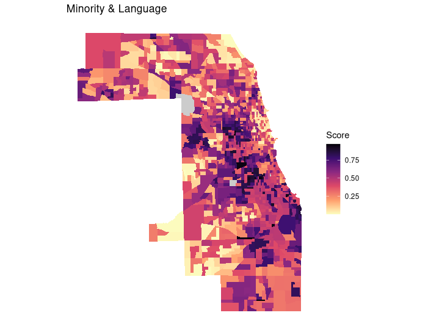

# Chicago Social Vulnerability Index (SoVI)

This project builds a **Social Vulnerability Index (SoVI)** for **Cook County, Illinois** using U.S. Census data.  
The goal is to create a modular R workflow that can be reused for other cities or states, and to provide an open dataset for exploring relationships between **social vulnerability** and **environmental issues** such as flooding, heat risk, or climate resilience planning.

---

## 📊 Data Sources
- **American Community Survey (ACS) 5-Year Estimates**  
  Pulled directly via the [census.gov API](https://www.census.gov/data/developers/data-sets/acs-5year.html).  
- **Geographic Unit**: Census tracts in Cook County, IL.

---

## ⚙️ Methodology
1. **Variable Selection**  
   - Variables commonly used in SoVI research (e.g., income, education, housing, race/ethnicity, age, disability, employment).  
   - Indicators standardized for comparability.  

2. **Normalization**  
   - All variables are normalized to a **0–1 scale** for consistency.  

3. **Two Approaches**  
   - **CDC SoVI (`svi_cdc.csv`):**  
     Uses the CDC’s weighting scheme, where indicators are grouped and combined into four domains (Socioecomonic Status, Household Composition & Disability, Minority Status & Language, Housing Type & Transportation) before final scoring.  
   - **PCA SoVI (`sovi_pca.csv`):**  
     Uses **Principal Component Analysis (PCA)** to reduce dimensionality and capture variance in the data.  
     This approach identifies key drivers of vulnerability empirically, rather than relying on predefined weights.

---

## 📂 Files
- [svi_cdc.csv](svi_cdc.csv) – Final SVI scores by census tract using the CDC weighted method.  
- [sovi_pca.csv](sovi_pca.csv) – Final SoVI scores by census tract using the PCA method.
- [sovi_both.csv](sovi_both.csv) - Combined CDC SVI and PCA SoVI scroes by census track.
- [sovi_script.R](sovi_script.R) – Main R script to download ACS data, process indicators, normalize, and compute SoVI.  
- `data/` – (Optional) Directory for storing raw ACS pulls or shapefiles if spatial joins are included.  
- `figures/` – Example plots and maps generated from the analysis.  

---

## 🗺️ Example Visualizations


### Choropleth Maps - PCA Social Vulnerability Index

  
*CDC weighted method applied to Cook County census tracts.*

---

### Choropleth Map – CDC Social Vulnerability Index & Domains
  
*CDC weighted method applied to Cook County census tracts.*

---

| Domain - Socioeconomic Status | Domain - Household & Disability |
|-------------|----------|
|  |  |


| Domain - Minority & Language | Domain - Housing & Transportation |
|-------------|----------|
|  |  |

---

### Scatterplot – Comparing PCA vs CDC SoVI
  
*A comparison between PCA-based and CDC-weighted SoVI scores. Red line shows linear fit (R² = 0.694).* 

*Correlation between the two methods was r = 0.833*

---

## 🔍 Next Steps
- Map results in **R (ggplot2/tmap)** or **QGIS** for visualization.  
- Compare SoVI scores against environmental data (e.g., flood risk, heat islands, pollution burden).  
- Expand the workflow for other counties and states in a more generalized script. 

---

## 📝 Citation / Acknowledgments
- CDC Social Vulnerability Index methodology: [CDC SVI Documentation](https://www.atsdr.cdc.gov/placeandhealth/svi/index.html)  
- Cutter, S.L. et al. (2003). *Social Vulnerability to Environmental Hazards*.  
- U.S. Census Bureau, American Community Survey (ACS) 5-Year Estimates.  

---

## 🚀 How to Run
```bash
# Clone the repository
git clone https://github.com/<your-username>/chicago-sovi.git
cd chicago-sovi

# Open R and run
source("sovi_script.R")
